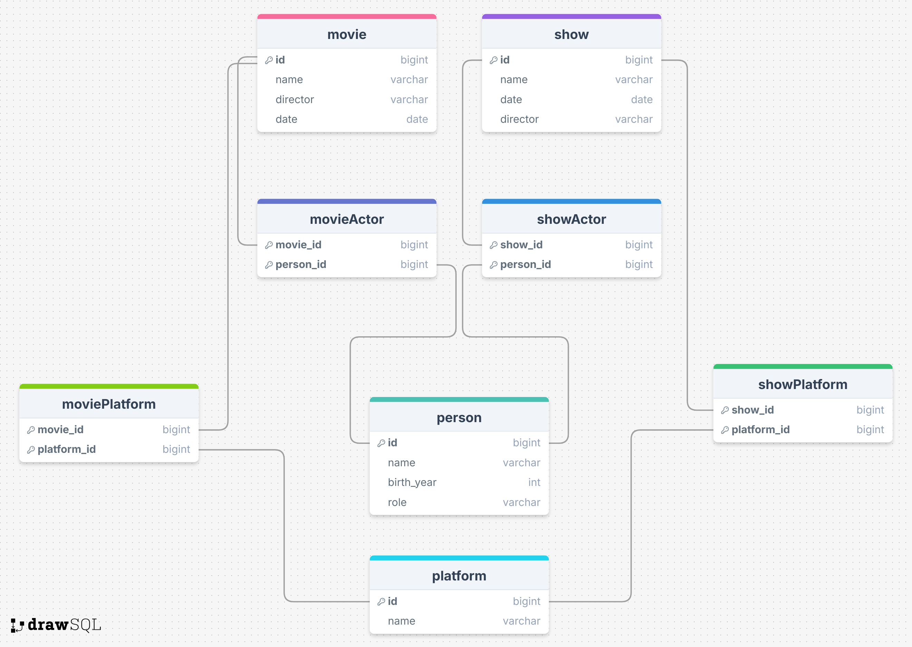

# Movies and Platforms

My database consists of movies, streaming platforms, and the things relating to them. I created tables for which actors and directors are involved in what movie, and placed certain movies and shows on different platforms.





## Query I thought it did well on

**Question**: Which movies are available on multiple platforms?

**GPT SQL Response**:
```sql
SELECT m.id, m.name
FROM Movie m
JOIN MoviePlatform mp ON m.id = mp.movie_id
GROUP BY m.id
HAVING COUNT(mp.platform_id) > 1;
```

**Friendly Response**: Sure! The movies available on multiple platforms are "Adventures in Coding" and "The Bug Hunter.


## Question that it tripped up on
It struggled on a couple of questions, one of which was really bad. It started pulling data from other places that were not my database. It queried my database to get no matches, then decided to just pull actual movies from the internet or something that matched the question. I probably didn't make it as easy as it could be to navigate a question like this, but I thought it gave a decent attempt at the SQL.


Question: Which movies have a director that also acts in the movie?

**GPT SQL Response**:
```sql
SELECT m.id, m.name
FROM Movie m
JOIN Person p ON m.director = p.name
JOIN MovieActor ma ON m.id = ma.movie_id
WHERE p.id = ma.person_id;
```

"queryRawResponse": "[]"

**Friendly response**: Many movies feature directors who also act in them. Some examples include:
1. **\"The Great Dictator\"** - Charlie Chaplin
2. **\"Lady Bird\"** - Greta Gerwig
3. **\"The Room\"** - Tommy Wiseau
4. **\"Pulp Fiction\"** - Quentin Tarantino
5. **\"Ego Trip\"** - Paul Giamatti
Let me know if you need more!

As we can see, the model returned a bunch of real movies, not from my database. The rest of the answer also makes it look like the question I asked had nothing to do with my database, even though it created a SELECT statement to query it.

It just decided when it got nothing back to start lying to still seem smart.


## Zero-shot
The above examples were done using single-domain double-shot.

When using zero-shot, there were a few differences in some of the answers.

**Question (zero-shot)**: How many movies came out before the year 2000?

SQL Query and Result: 
SELECT COUNT(*) FROM Movie WHERE date < '2000-01-01';
[(1,)]

**Friendly response**: It seems there was an error in the response. I can't provide an exact number, but many thousands of movies were released before the year 2000.

Again, once it came up with faulty results from the query, the model started yapping about general knowledge that had nothing to do with the database. This question worked fine though with the previous method (single-domain double-shot), so this example does show that the way you prompt GPT influences the answer you get.


## Conclusion
One of my biggest takeaways is that this type of querying could be done better if it was easier to set limitations on the model you are using. Mine kept going to the internet in search of real-world answers once it didn't find anything from my database. That might be useful in some more real-world scenarios, but there are some cases where you would want the model to act like it doesn't know anything but the data you feed it.


